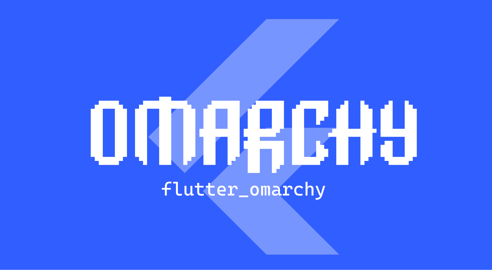
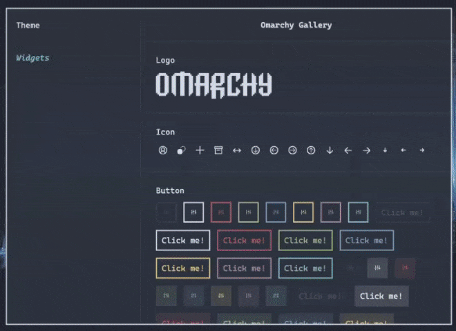
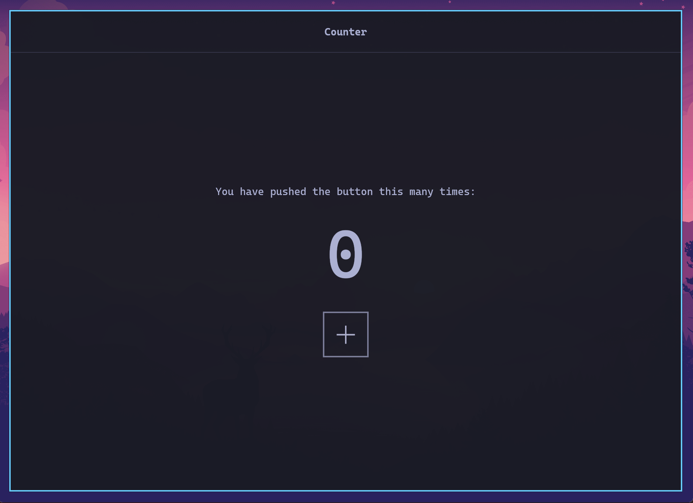
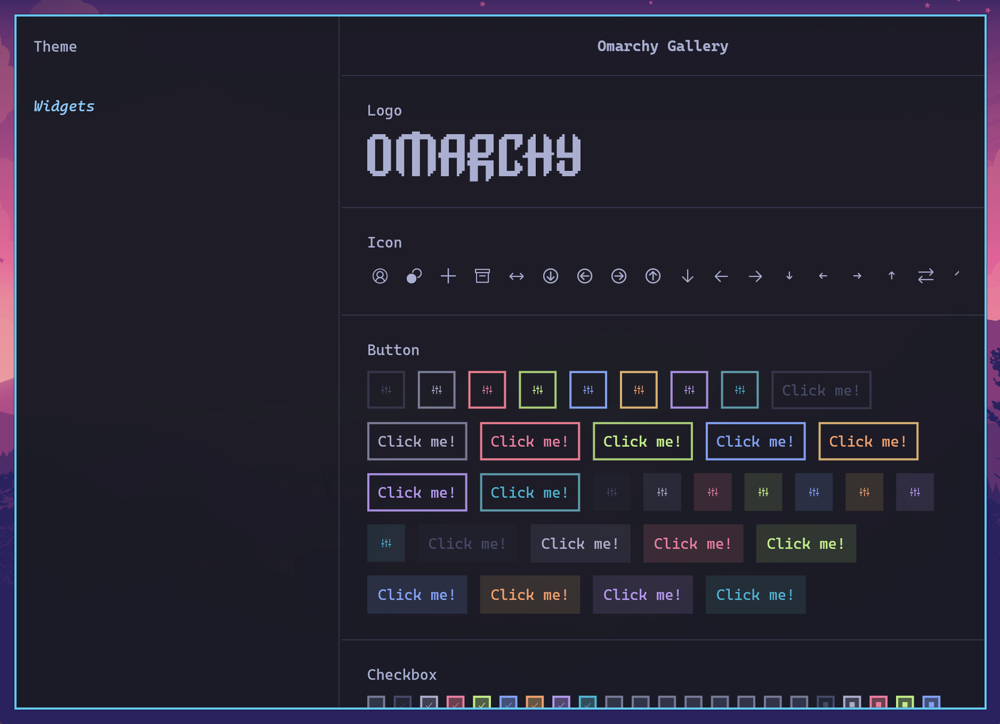
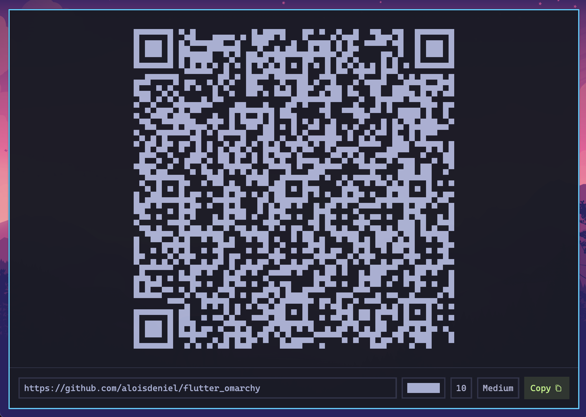
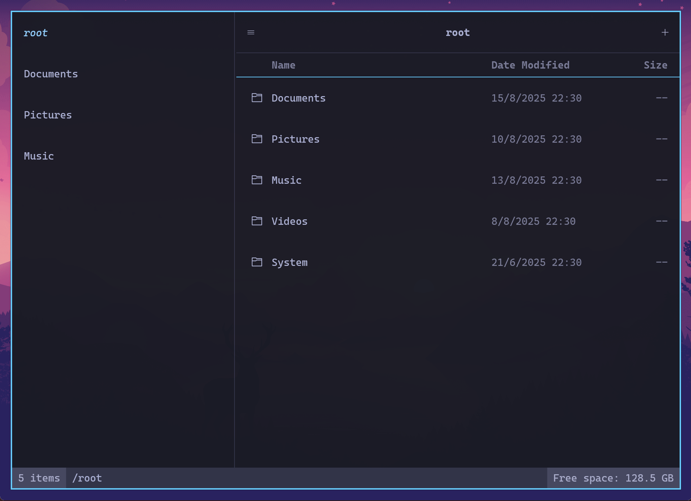
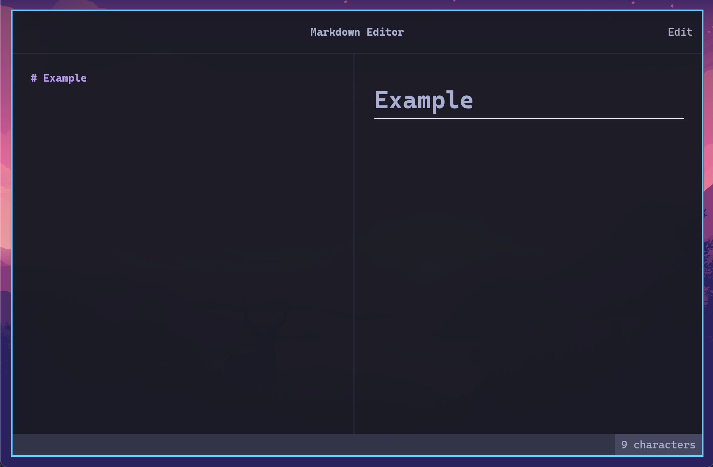
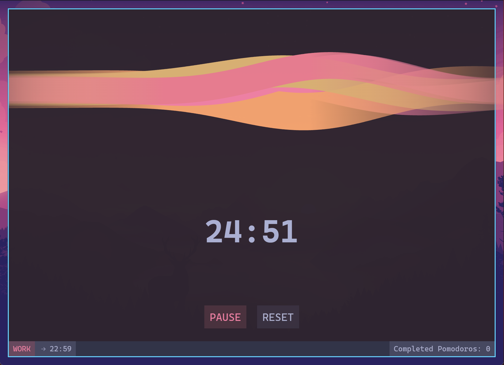

[](https://pub.dev/packages/flutter_omarchy)
[](https://github.com/aloisdeniel/flutter_omarchy)
[](https://opensource.org/licenses/MIT)

A Flutter package for developing applications for [Omarchy](https://omarchy.org).

> **⚠️ DISCLAIMER:** This package is in a very early development stage. The API is unstable and may change significantly without notice. Use at your own risk in production applications.

## Introduction

Flutter Omarchy is a specialized UI toolkit designed for building applications that seamlessly integrate with the [Omarchy](https://omarchy.org) Archlinux configuration created by [DHH](https://x.com/dhh). This package bridges the gap between Flutter's powerful development capabilities and the minimalist, terminal-inspired aesthetic of the Omarchy system. 

## Quickstart

### Installation

Add Flutter Omarchy to your `pubspec.yaml`:

```bash
flutter pub add flutter_omarchy
```

### Basic Usage

```dart
import 'package:flutter_omarchy/flutter_omarchy.dart';

Future<void> main() async {
  await Omarchy.initialize(); // This is required to load fonts
  runApp(MyApp());
}

class MyApp extends StatelessWidget {
  @override
  Widget build(BuildContext context) {
    return OmarchyApp(
      home: OmarchyScaffold(
        child: Center(
          child: OmarchyButton(
            onPressed: () {},
            child: Text('Hello Omarchy!'),
          ),
        ),
      ),
    );
  }
}
```

## Usage

### App Structure

The `OmarchyApp` widget is the root of your application:

```dart
OmarchyApp(
  home: MyHomePage(),
)
```

### Theming

Flutter Omarchy automatically adapts to the system theme of the Omarchy environment and respond to system-wide theme changes without additional configuration.



Flutter Omarchy extracts its theme from the current Omarchy theme, just as the Omarchy system does. The package reads:

- **Omarchy Theme Palette**: Located at `~/.local/state/omarchy/current/theme/colors.toml`, this canonical palette defines all the theme colors (background, foreground, accent, selection, ANSI colors, ...).
- **Alacritty Configuration**: Located at `~/.config/alacritty/alacritty.toml`, this file provides the font settings, and acts as a color fallback on older Omarchy versions.

The package automatically observes the Omarchy state directory for changes. When you run `omarchy theme set <name>`, the theme updates in real-time across all Flutter Omarchy applications without requiring a restart.

You can access the current theme in your application using:


```dart
final theme = OmarchyTheme.of(context);
final red = theme.colors.normal.red; // Normal terminal color
final brightRed = theme.colors.bright.red; // Bright terminal color
final accent = theme.colors.accent; // The theme accent color
final body = theme.text.normal.copyWith(color: red); // The text style
```

#### ANSI colors

Since Omarchy is heavily inspired by terminal aesthetics, the theme an `AnsiColor` enum to represent one of the eight main colors of the terminal. You can extract the normal or bright variant of a color from the theme:

```dart
final accent = AnsiColor.cyan;
final theme = OmarchyTheme.of(context);
final accentNormal = theme.colors.normal[accent];
final accentBright = theme.colors.bright[accent];
```

### Widgets

Omarchy provides a rich set of widgets:

#### Basic Widgets

- `OmarchyButton`: Terminal-style button (outline, filled and bar styles)
- `OmarchyTextInput`: Text input field
- `OmarchyCheckbox`: Checkbox component
- `OmarchyRadio`: Radio button for single-choice groups
- `OmarchyToggle`: On/off toggle switch
- `OmarchySlider`: Horizontal slider with keyboard support
- `OmarchySelect`: Dropdown selection
- `OmarchyTile`: List tile component
- `OmarchyBadge`: Small status or count label
- `OmarchyProgressBar`: Progress indicator
- `OmarchyLoader`: Animated loading indicator

#### Navigation

- `OmarchyScaffold`: Main layout container
- `OmarchyNavigationBar`: Top navigation bar with leading/trailing actions
- `OmarchyTabs`: Tabbed interface with closable tabs
- `OmarchyStatusBar`: Status bar for displaying app state
- `OmarchyTree`: Tree view for hierarchical data

#### Layout

- `OmarchyDivider`: Horizontal or vertical divider
- `OmarchySplitPanel`: Resizable two-pane layout
- `OmarchySidePanel`: Overlay side panel (drawer)
- `OmarchyResizeDivider`: Resizable divider for split views

#### Overlays

- `OmarchyTooltip`: Tooltip component
- `OmarchyPopOver`: Popup overlay
- `OmarchyDialog` / `showOmarchyDialog` / `showOmarchyConfirmDialog`: Modal dialogs
- `OmarchyContextMenuArea` / `showOmarchyContextMenu`: Right-click context menus
- `showOmarchyToast`: Transient notifications stacked at the bottom right
- `OmarchyCommandPanel` / `showOmarchyCommandPanel`: Command palette

## Bundling the app for Omarchy

To bundle and run your Flutter Omarchy application on Linux, follow these steps:

### Remove the Title Bar

Flutter Linux apps are GTK windows. To remove the default GTK header bar, edit `linux/runner/my_application.cc` and disable it:

```c
gboolean use_header_bar = FALSE;
```

Under Hyprland (Omarchy's compositor) windows are tiled and undecorated, so this is all that is needed for a clean, borderless window. Rebuild the app to apply the change. The `omarchy_app` mason template applies this automatically.

### Avoid the Black Window at Startup

By default, older Flutter Linux runners show the GTK window immediately, before Flutter has rendered anything. Since the Flutter view's surface defaults to black, the window appears filled with black for a moment at startup, before the theme background is painted.

The fix is to keep the window hidden until Flutter has rendered its first frame, using the `first-frame` signal of `FlView`. Recent Flutter versions (3.22+) generate a `linux/runner/my_application.cc` that already does this. If your runner was generated by an older Flutter version, update `my_application_activate` in `linux/runner/my_application.cc`:

```c
// Called when the first Flutter frame is received: only show the
// window at this point to avoid a black window at startup.
static void first_frame_cb(MyApplication* self, FlView* view) {
  gtk_widget_show(gtk_widget_get_toplevel(GTK_WIDGET(view)));
}

static void my_application_activate(GApplication* application) {
  // ...
  gtk_window_set_default_size(window, 1280, 720);
  // Do NOT call gtk_widget_show(GTK_WIDGET(window)) here.

  FlView* view = fl_view_new(project);
  gtk_widget_show(GTK_WIDGET(view));
  gtk_container_add(GTK_CONTAINER(window), GTK_WIDGET(view));

  // Show the window when Flutter renders its first frame. The view must be
  // realized so rendering can start while the window is still hidden.
  g_signal_connect_swapped(view, "first-frame", G_CALLBACK(first_frame_cb),
                           self);
  gtk_widget_realize(GTK_WIDGET(view));

  fl_register_plugins(FL_PLUGIN_REGISTRY(view));
  gtk_widget_grab_focus(GTK_WIDGET(view));
}
```

The `omarchy_app` mason template applies this patch automatically when the generated runner does not already handle it.

### Building the Linux Bundle

1. Make sure you have the required Linux dependencies installed:

   ```bash
   sudo pacman -Syu --needed xz glu
   sudo pacman -S --needed clang cmake ninja pkgconf gtk3 xz gcc
   
   mise plugins install flutter https://github.com/mise-plugins/mise-flutter.git
   mise use -g flutter@latest
   ```

2. Build the release version of your application:

   ```bash
   flutter build linux --release
   ```

3. The bundled application will be available in the `build/linux/x64/release/bundle/` directory.

### Running the Application

You can run the bundled application directly:

```bash
cd build/linux/x64/release/bundle/
./your_app_name
```

## Application template

Templates are available to help you get started quickly with common application types. You can find these templates in the `templates/` directory of the repository.

To initialize a simple application structure with database and state management with mason:

```bash
mason add omarchy_app
  --git-url https://github.com/aloisdeniel/flutter_omarchy
  --git-path templates/omarchy_app
mason make omarchy_app -o ./my_app 
```

## Running on other platforms *(Windows, macOS, Android, iOS, Web)*

Flutter Omarchy is a pure Flutter package, making it compatible with all Flutter-supported platforms including Windows, macOS, Android, iOS, and Web. If the Omarchy configuration files aren't found on these platforms, the theme automatically falls back to the Tokyonight theme, ensuring a consistent visual experience.

While the package should run without issues on all platforms, please note that our primary focus is on the Omarchy Linux platform. Some features may not be fully tested on other platforms, and platform-specific optimizations might be limited. We welcome feedback and contributions to improve cross-platform compatibility.

## Example

The package includes several example applications. 

Note that these examples are just basic showcases for components, and the logic behind them might be incomplete or not suitable for production use. They're designed to demonstrate the visual appearance and basic functionality of the Omarchy widgets rather than provide complete application solutions.

To run one of the example application from Omarchy:

```bash
cd example
flutter run --app=pomodoro
```

### Counter



[View in browser](https://aloisdeniel.github.io/flutter_omarchy/?app=counter) | [Code](example/lib/counter.dart)

### Gallery



[View in browser](https://aloisdeniel.github.io/flutter_omarchy/?app=gallery) | [Code](example/lib/gallery.dart)

### QR Code Generator



[View in browser](https://aloisdeniel.github.io/flutter_omarchy/?app=qr_code_generator) | [Code](example/lib/qr_code_generator.dart)

### File Explorer



[View in browser](https://aloisdeniel.github.io/flutter_omarchy/?app=file_explorer) | [Code](example/lib/file_explorer.dart)

### Markdown Editor



[View in browser](https://aloisdeniel.github.io/flutter_omarchy/?app=markdown_editor) | [Code](example/lib/markdown_editor.dart)

### Pomodoro



[View in browser](https://aloisdeniel.github.io/flutter_omarchy/?app=pomodoro) | [Code](example/lib/pomodoro.dart)

## Roadmap & Ideas

* Vim motions in text inputs
* Simplified application wide shortcuts configuration
* Preconfigured HJKL shortcuts for navigation
* Specific ormarchy theme configuration (colors, hide nav bar, ...)
* Widgets 
  * Skeleton
  * Menu bar
  * Date/time pickers
  * Table / data grid
* Examples
  * Todo list
  * AI Chat
  * World clocks
  * Podcast player
  * Password manager
  * Contact book
  * Drawing pad (drawing + text)
  * Raycast-like launcher
  * Calendar
  * Notes app

## How to Contribute

Contributions are welcome! Here's how you can help:

1. **Fork the Repository**: Create your own fork of the project
2. **Create a Branch**: Make your changes in a new branch
3. **Submit a Pull Request**: Open a PR with a clear description of your changes
